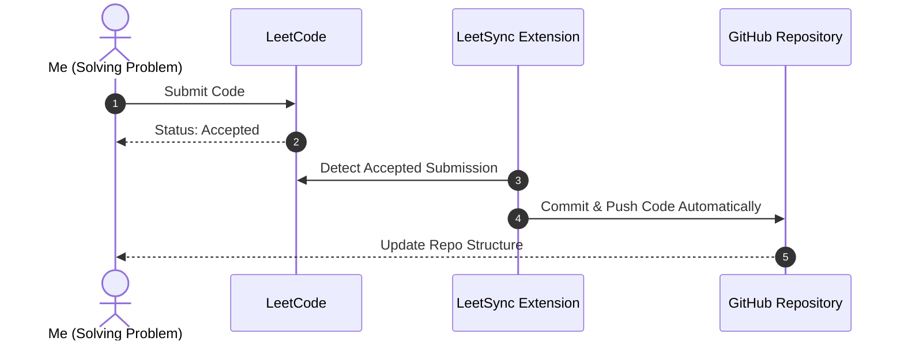

# Leetcode-solutions
A repository containing my accepted LeetCode submissions, synced automatically via LeetSync
# 🏆 LeetCode Solutions

<p align="center">
  
</p>

<h3 align="center">My Journey of Problem Solving and Algorithmic Thinking</h3>

<p align="center">
  
  
  
</p>

---

## 🌟 Overview

This repository serves as a centralized log of all my successfully solved coding challenges on [LeetCode](https://leetcode.com/). The solutions are automatically synced and pushed here in real-time immediately after receiving the **Accepted** status on LeetCode.



---

## 📊 Performance Statistics

Here is a summary of the problems solved, categorized by difficulty levels.

| Category | Difficulty | Solved Count | Status |
| :---: | :--- | :---: | :---: |
| 🟢 | **Easy** | `0` | In Progress 🔄 |
| 🟡 | **Medium** | `0` | In Progress 🔄 |
| 🔴 | **Hard** | `0` | In Progress 🔄 |
| **Total** | **All Categories** | `0` | Active 🔥 |

---

## 🛠️ Languages and Tools

*   **Primary Languages:** C++ / Python / Java
*   **Automation Tool:** LeetSync (Chrome Extension)
*   **Version Control:** Git & GitHub

---

## 📂 Repository Layout

The synced directory follows a clean and logical layout generated automatically:

```
leetcode-solutions/
├── 0001-two-sum/
│   ├── README.md           # Problem Description
│   └── solution.cpp        # Source Code (C++)
├── 0217-contains-duplicate/
│   ├── README.md
│   └── solution.py         # Source Code (Python)
└── 0704-binary-search/
    ├── README.md
    └── solution.java       # Source Code (Java)
```

---

## 🚀 How to Set Up This Automation

If you want to sync your solutions automatically like this:
1. Create a public GitHub repository named `leetcode-solutions`.
2. Install the **LeetSync** extension in Chrome.
3. Authenticate LeetSync with your GitHub account and select your repository.
4. Log into LeetCode and solve a problem. It will sync automatically!

---

<p align="center">
  <i>Keep Coding, Keep Improving! 🚀</i>
</p>

<!---LeetCode Topics Start-->
# LeetCode Topics
## Array
|  |
| ------- |
| [0014-longest-common-prefix](https://github.com/Prashant9128/Leetcode-solutions/tree/master/0014-longest-common-prefix) |
## String
|  |
| ------- |
| [0014-longest-common-prefix](https://github.com/Prashant9128/Leetcode-solutions/tree/master/0014-longest-common-prefix) |
## Trie
|  |
| ------- |
| [0014-longest-common-prefix](https://github.com/Prashant9128/Leetcode-solutions/tree/master/0014-longest-common-prefix) |
<!---LeetCode Topics End-->